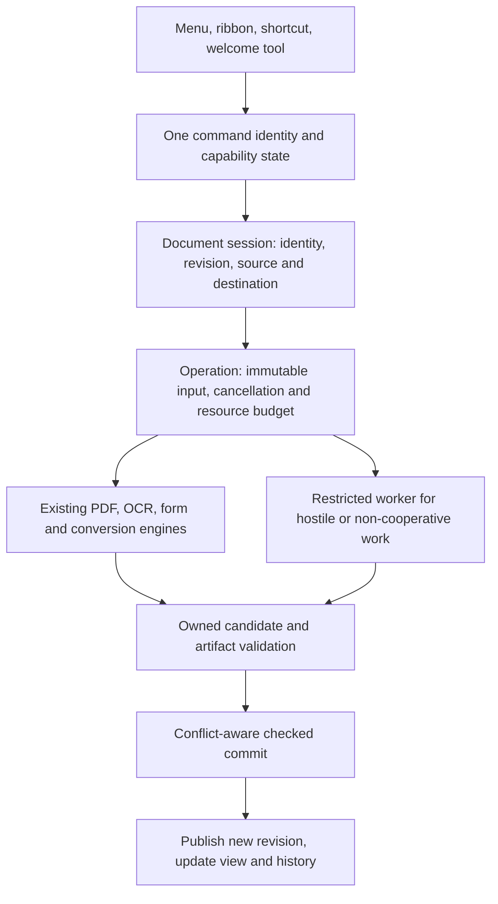

# GlyphPDF whole-project readiness review

Finalized 2026-09-11 against the explicitly recorded September 10 source snapshots. Later commits are outside this report.

**Recommendation: retain the C++/Qt foundation, close integrity and workflow defects, then build a narrowly supported native Linux edition. Hold broad corporate-readiness and Acrobat-parity claims until the release gates below pass.** The code contains substantial real functionality. The largest remaining gap is the consistency of its contracts: what a command promises, what the engine commits, what the UI displays, and what the evidence ledger calls verified.

This report brings together architecture, product/planning and Linux review agents with the primary reviewer's source tracing and fresh comparison/JavaScript probes. Agents were resumed after usage-limit interruptions. It is a broad project review, not a claim that every line or every feature has been independently executed. No production code, installed application, customer document or repository branch was changed by the review; Git fetch updated remote-tracking refs.

## Scope and evidence cutoff

| Scope | Preserved reference | Treatment |
|---|---|---|
| Main checkout | `main` at `703fa34` | Historical baseline only; deliberately not the implementation under review |
| Initial integration snapshot | `4e2c99ae345eab8b93bbe5899df12b2a6d39d208` | Broad source analysis and fresh comparison probes |
| Fetched published branch | `origin/feat/parity-glm` at `9ba3cea499f67060604ee09903f63ea1a79c30fd` | Final published-source delta reviewed; 30 files changed from the initial snapshot |
| Local integration work | `feat/parity-glm` at `b38a4fd524e754fc91981f7bbeba254d85674c24` | Additional Form JavaScript code; separately inspected and probed, not included in the fetched published branch |
| Active worktree | `feat/parity-glm-quick` at `7711bc5`, with a dirty ToolId header | In-progress work; commit headlines show measurement CSV and XFA disclosure. Not treated as a verified published feature |

The actual development directory is `C:\Users\User\Projects\pdf-parity`. It changed branches during the review, so the review uses immutable source exports rather than following the mutable working directory. `baseline.json`, `published-baseline.json`, source-archive hashes and the published/local delta files are preserved in [the evidence directory](<C:/Users/User/Documents/Codex/2026-09-05/read-c-users-user-projects-pdf/work/whole-project-2026-09-10>).

The new published commits address G10/G11/G14/G15, G16–G20, startup recovery interaction and signing replacement/retry behavior. Their new tests and ledger descriptions are progress. They remain **implemented-awaiting-review** until the independent package protocol is completed. Earlier reports must not be used to claim all those defects still exist.

Read these companion reports for exact source references, triggers and acceptance criteria:

- [Architecture, persistence and job ownership](<C:/Users/User/Documents/Codex/2026-09-05/read-c-users-user-projects-pdf/outputs/WHOLE-ARCHITECTURE-REVIEW-2026-09-10.md>).
- [Product, UI and planned-versus-actual capabilities](<C:/Users/User/Documents/Codex/2026-09-05/read-c-users-user-projects-pdf/outputs/WHOLE-PRODUCT-AND-PLAN-REVIEW-2026-09-10.md>).
- [Performance, comparison and Form JavaScript findings](<C:/Users/User/Documents/Codex/2026-09-05/read-c-users-user-projects-pdf/outputs/PERFORMANCE-AND-SCRIPT-REVIEW-2026-09-10.md>).
- [Native Linux blockers and staged delivery plan](<C:/Users/User/Documents/Codex/2026-09-05/read-c-users-user-projects-pdf/outputs/NATIVE-LINUX-READINESS-2026-09-10.md>).

## The issues that should determine the next implementation wave

| Priority | Finding | Why it matters | Required outcome |
|---|---|---|---|
| Release blocker for local JS | A script can bypass the Form JavaScript deadline during result collection | A malformed/hostile form can keep the interpreter running inside the app | Budget every engine entry and result conversion; both reproduced bypasses terminate without the external harness killing the process |
| Release blocker for reliable comparison | Page alignment and content comparison disagree after an insertion | Unchanged contract pages are reported as rewritten | One old/new page-pair mapping drives comparison, navigation and exports |
| Release blocker for affected commands | Rotate and inline-text history paths remain outside the checked mutation/undo contract | Failed edits can still move history or split restoration into separately committed steps | Complete command-family coverage; failed edits/undo preserve state, position and retryability |
| Release blocker for package export | Encrypted package export deletes its destination before the external operation succeeds | A failed export can destroy the previous package | Write a private candidate and replace only after validation |
| Release blocker for affected save path | Failure rollback can reload disk rather than the pre-operation resident state | Earlier unsaved work, such as a watermark, can be lost after a later failed save | Preserve the complete prior resident revision on failure, not merely the old disk bytes |
| High | Find/Replace paints an overlay and uses fixed geometry; Replace All accounting is unchecked | A command labeled replacement can retain original extractable text and report success incorrectly | Real content replacement or explicit supported-scope refusal; exact match geometry; success counts from committed outcomes |
| High | Print selection, job ownership and rendering/error handling need repair | Selected pages, cancellation and closing/switching documents must behave predictably | Immutable print-job input, honored range/order, checked painter/spool outcomes and safe teardown |
| High | No shared-file version conflict guard found in save/session paths | A colleague or sync client can change a file while it is open | Detect divergence before overwrite; offer review/reload/Save As while retaining local work |
| High | Temporary cleanup treats age/name as ownership and inactivity | A second process can remove an older still-active session's working files | Per-session ownership/lease with liveness checks; remove only proven orphaned files |
| High | Native Linux build, replacement semantics and secret storage have material gaps | A build that launches can still lose recovery data or persist weakly protected secrets | Complete the Linux safety foundations before a native beta |
| Next | Compare memory growth and actual viewer allocation paths are not bounded consistently | Large documents can exhaust the machine despite individual cache limits | Operation-wide budgets, cancellation and bounded retained output |

The comparison and JavaScript cases are reproduced. Several other entries are high-confidence source findings with explicit failure triggers; their reports distinguish these from runtime reproductions. They should receive targeted regression tests before being considered fixed.

The architecture review also found a missed document-load identity increment in the qpdf-repair success branch. Scheduler shutdown hazards exist in its reusable API, but the reviewed desktop does not route its normal OCR jobs through that scheduler. Do not advertise a reproduced desktop scheduler hang or spend the first optimization wave on an unused path.

## What to keep, and what to tighten in the architecture

Keep Qt Widgets/C++, the engine interfaces, SafeSave's candidate/validate/commit approach, document generation/revision identities, CapabilityRegistry, provenance/read-only guards and artifact-based regression tests. These are useful foundations. A wholesale framework rewrite would put working PDF behavior and persistence guarantees at risk without resolving the observed defects.

The current layering is partly organizational rather than enforced. A header-only `pdfws_core` does not itself prevent upward dependencies. Engines link Qt Widgets and some operations cross directly between controllers, mutable editor state and view state. Several implementations can render or save the same document through different paths. The practical fix is a small set of explicit contracts, enforced at existing shared boundaries:

This is a target flow, not a statement that every operation already follows it. Apply it incrementally:

1. **Mutation contract:** one operation either publishes a fully validated revision or leaves disk, resident model, history and dirty state consistent. Enumerate the commands that mutate only memory, commit immediately, or use an external tool; choose and document the contract for each instead of mixing them accidentally.
2. **Session contract:** identity is more than a path. Preserve the existing generation/revision work and extend it through repair, recovery, same-path reopen, asynchronous completion and external file changes. Separate original destination, recovered working input and exported copies.
3. **UI command contract:** reuse the current registry and QAction infrastructure. The same command must have the same enabled/check state and reason on ribbon, menus, shortcuts and contextual tools. Policy enforcement must also exist at the operation boundary.
4. **Job contract:** own inputs, futures, cancellation and teardown. A job must not capture a live view-owned document and outlive it. A Cancel button must eventually stop work, not just hide results. Use a killable restricted process where a native library cannot cooperate safely.
5. **Resource contract:** account for simultaneous renderer, compare, OCR, intermediate image and result buffers. A 256 MiB cache limit is not a 256 MiB process limit. Avoid creating another scheduler merely because the existing one is not connected; first map and consolidate actual callers.
6. **Platform contract:** isolate only real OS differences—credential stores, file replacement/durability, deployment/update channel and desktop integration. Keep the portable PDF domain logic shared.

Refactor large files when a tested contract can be extracted, not just to reduce their line counts. Deleting dead files should remain evidence-based. Preserve regression fixtures, optional-build coverage and failure-path tests; a failing test is not dead code.

## Reconcile plans before adding another feature list

The reviewed planning set includes PRD/ROADMAP, the parity ledger, command matrix, the migrated research corpus, the September 8 synthesis, three implementation plans and the new September 10 consolidated backlog. Some documents now contradict both the code and one another.

The most serious process error is in `docs/research/RESEARCH-BACKLOG-2026-09-10.md:17`: its `SHIPPED` vocabulary explicitly includes `implemented-awaiting-review`. This conflicts with the agreed independent verification protocol. Replace this with separate implementation, review and release fields. A commit, a passing implementation test and a distributed release are different facts.

The older synthesis calls measurement and redaction proof missing; both now have implementation and tests, with scoped residuals. Search/replace, comment statuses, certification and certificate-encryption seams also exist to varying degrees. Rebuilding these as if absent would create duplicate paths. Conversely, existing signing engine code does not prove the UI can configure timestamps or produce every advertised PAdES level.

The current local Form JavaScript Phase 1 code changes the earlier Option A/B discussion: it is now implementation work awaiting review, with a reproduced blocker. Calculate/Format must not be collapsed into a promise of Validate/Keystroke/document-open support. Preserve the local row's recorded authorization and verify its scope in the implementing session rather than inferring authorization from this review.

Feature priorities should follow complete customer workflows:

| Workflow | Finish first | Expansion after the reliability gate |
|---|---|---|
| Office forms and expense claims | Open, fill, correct calculations, save/reopen, print selected pages | Validate/Keystroke compatibility, safer form import/export, better appearances |
| Legal review | Accurate compare, annotations, dependable undo/save, honest redaction limits | Comment summaries, reusable reason codes, local signing-request bundles |
| Records and scanning | Trustworthy OCR review, bounded memory, batch accounting, recoverable output | Named multi-step presets, skip-already-text, content-based splitting |
| Engineering/measurement | Calibration, units, saved measurement fidelity and exports | Per-viewport calibration and deeper drawing workflows if pilot demand supports them |
| Managed desktop | Clean install/update/uninstall, policy controls, support diagnostics | Additional enterprise integrations only when customers require them |

Treat research counts as a prioritization input, not proof of market demand or superiority. Counting competitors that advertise a feature does not measure how often customers use it. Claims such as “zero competitors” or “moat” need direct evidence and matching editions/workflows before publication. The new backlog's 1–3 hour estimates also exclude integration, failure handling, localization, packaging and independent review; use acceptance gates and measured effort instead.

## Make the UI feel professional by completing actions and feedback

The source review still finds 52 hidden entries out of 144 planned ribbon entries, a six-card welcome grid constrained to 600 px, and Convert/Protect cards that only open a document. The earlier [UI button review](<C:/Users/User/Documents/Codex/2026-09-05/read-c-users-user-projects-pdf/outputs/UI-BUTTON-REVIEW-2026-09-09.md>) remains useful context; the current source report rechecks the relevant paths. The installed app predates this work and was not used as evidence of the current build's appearance.

Show useful breadth without pretending unfinished work is available. Present implemented actions through their real command routes. Keep requested planned tools discoverable, but disabled with a short reason and a practical alternative. Do not create enabled decorative buttons. Where an existing function lives in a mode or context menu, connect to it rather than add a second implementation.

Recommended welcome tools are Open PDF, Create PDF, Merge, Split/Extract, Compress, Convert, OCR, Organize Pages, Fill Forms, Sign, Redact and Batch. Clicking Convert should retain the user's intent through document selection and enter conversion with the appropriate setup. Support drag-and-drop, recent/pinned documents, filename search, clear missing-file states and an All Tools search backed by the existing registry. The exact ordering should be tested against frequent tasks.

Borrow **workflow clarity** from PDFelement's task-oriented home and **consistent command organization/management** from PDF-XChange; do not copy branding or add every competitor feature at once. The official [PDFelement home guide](https://pdf.wondershare.com/guide/open-pdf-from-home.html) and [PDF-XChange workspace guide](https://help.pdf-xchange.com/pdfxt11/workspace-basics.html) are references for interaction patterns, not evidence that GlyphPDF matches their functionality.

Small details with disproportionate impact:

- Keep file name, modified/recovered/read-only/signed state and actual save destination legible. “Saved” must mean a completed PDF commit, not just a sidecar write.
- Give each operation a useful final result: pages affected, successful/failed/skipped items, output path and an Open Output action. Counts must come from actual committed results.
- Preserve page/zoom/selection where appropriate after reload; retain dialog choices when retrying a recoverable failure. Never force users to re-enter a long form after an error.
- Make Esc/cancel, keyboard focus, shortcut hints, accessible names, tab order and screen-reader status updates consistent. Disabled controls need an explanation that keyboard users can discover.
- Check 100/125/150/200% scaling, mixed-DPI monitors, small windows, light/dark/high-contrast themes and native font fallback. Improve missing/generic icons before adding ornamental styling.
- Test Arabic and other RTL text, mixed-direction filenames, CJK, decimal/date locale differences and long translated strings through save, search, copy and print. An RTL layout toggle alone does not establish document-text correctness.
- Keep progress responsive and distinguish queued, running, canceling and completed. Avoid a frozen dialog that calls itself asynchronous because work began on a thread.
- Keep privacy visible: local processing labels should describe the current action accurately, including optional update, TSA/OCSP, model download and helper integrations.

## Corporate readiness is an operational product layer

These are recommended acceptance requirements for a managed desktop product, not claims of legal compliance or certification:

| Area | Existing footing | Missing or unproven gate |
|---|---|---|
| Data integrity | SafeSave, recovery, generation IDs, failure tests | Complete mutation/undo coverage; external-change conflicts; full-disk/network-share failure and interrupted-save recovery |
| Hostile documents | Native guards, fuzz targets, script I/O restrictions | Current threat model; resource budgets; safe process boundaries for non-cooperative work; replay corpus against shipped dependencies |
| Deployment | MSI/portable tooling and signing checks | Clean standard-user install, upgrade, repair, rollback and uninstall using the exact release artifact; no source-tree runtime dependencies |
| Administration | CapabilityRegistry and user preferences | Enforced machine policy, with locked state visible in UI; update channel, scripting, network endpoints, model acquisition and diagnostics controls |
| Supportability | Logs, security policy and audit documents | Redacted opt-in support bundle with app/build/dependency versions, capability status and error IDs; no PDF text/secrets by default |
| Supply chain | License records, dependency checks and vendor pins | Artifact-level dependency inventory/SBOM, runtime hashes, provenance and patch ownership including transitive parser libraries |
| Accessibility | Qt accessibility facilities and partial UI work | Keyboard/screen-reader workflow tests; distinguish accessible application UI from tagged PDF/PDF-UA authoring and validation |
| Compatibility | Multiple PDF engines, converters and signing code | A maintained corpus of real supported forms, fonts, scans, signatures and exports, checked in independent readers |
| Performance | Caches, threading and a soak plan | Current real-path benchmarks, cancellation, resource ceilings and completed soak evidence on representative hardware |

PDF-XChange publishes administrative templates covering areas such as JavaScript, security, preferences, toolbars and updates. That is a practical enterprise benchmark: policies must affect runtime behavior, not merely distribute a preferences file. [Official administrative template documentation](https://help.pdf-xchange.com/sysadmin/editor-templates.html).

Adobe documents Protected Mode/Protected View as explicit controls around untrusted documents. This supports treating the parser/script boundary as product architecture, rather than equating an interpreter's missing I/O APIs with complete process isolation. [Official Protected Mode/View guidance](https://helpx.adobe.com/reader/desktop/protected-mode-windows.html).

Do not add SSO, a cloud admin portal or collaborative storage just to look enterprise-ready. For this offline desktop product, reliable managed deployment, policies, shared-file safety and a support process come first. The existing `SECURITY.md` and June threat model need reconciliation: plaintext-credential statements and supported-version labels lag later changes. Review the actually shipped dependency closure even where the vulnerability intake policy excludes upstream-library defects.

The portable README says nothing is written to the registry, but the app uses default QSettings without a portable settings mode. Fix the behavior or the promise. Its Windows 10 1607 claim also needs validation against the chosen dependency build; Qt 6.11's published support table starts at 1809. Do not infer GlyphPDF's minimum OS solely from source compilation. [Qt supported platforms](https://doc.qt.io/qt-6/supported-platforms.html).

## Performance acceptance should describe what users feel

The fresh comparison probe retained 25.245 MB of empty overlays for only three unchanged pages. The Myers probe used about 134 MiB peak working set for 2,000 entirely different tokens per side. These are concrete optimization targets. Correct the stale render hot-path document before optimizing unused cache code.

Use the following as **proposed initial targets**, to be calibrated on a named reference machine and document corpus—not as measured current performance:

| Interaction | Proposed target / gate |
|---|---|
| Visible response to click/typing | Within 100 ms for ordinary UI actions; start progress promptly for longer work |
| Cold start to usable welcome | P95 under 2 s on an agreed SSD reference machine; record warm start separately |
| Open ordinary 20-page office PDF to first useful page | P95 under 1 s on that corpus; measure complex scans/drawings separately |
| Cancel feedback | UI acknowledges within 100 ms; cooperative work stops within 1 s; documented watchdog for non-cooperative workers |
| Scrolling/zoom | Record frame/interaction latency and dropped frames on actual QPdfView and two-page paths at each supported scale |
| Memory | Explicit per-job and overall budget; no growth proportional to full-resolution images of every unchanged page |
| Long sessions | Run the existing 48-hour soak, but add interaction latency and cleanup/handle checks; a 30-second freeze threshold is too permissive for usability |

Report p50/p95, cold/warm cache, file/page complexity, CPU/RAM, display scale, OS and dependency versions. Use synthetic adversarial fixtures alongside permission-cleared real documents. Keep telemetry local by default; these measurements can be collected in development and consenting pilots without uploading customer document contents.

## Native Linux strategy

Native Linux is feasible with the existing C++/Qt stack. “Native” here means Linux-built ELF binaries and native platform integration, not Wine or an embedded web rewrite. Start with one explicitly supported x86_64 LTS desktop configuration, then add a second desktop/backend. Qt lists supported Linux configurations, but the actual Qt module/dependency artifacts and ABI floor still need verification. [Qt platform matrix](https://doc.qt.io/qt-6/supported-platforms.html).

The companion Linux report provides the concrete blockers. Key items are Windows linker flags and discovery assumptions, Windows-only binary artifacts, deletion-before-rename recovery semantics, weak non-Windows secret-key derivation, source-tree Djot lookup, missing full native app CI and incomplete desktop packaging. Existing Linux fuzz CI is useful but is not a native product build/release gate.

Recommended sequence:

1. **Portable configure and native CLI/core:** separate Windows toolchain settings; pin platform-specific dependency artifacts; build from a clean Linux machine with no Windows vendor trees. Keep default Windows behavior tested.
2. **Platform safety:** atomic replacement and recovery, permissions, session-owned temporary data, Secret Service credentials with a session-only fallback, resource discovery and honest unsupported capabilities.
3. **Native desktop beta:** install tree, `.desktop`/MIME/icon integration, XDG paths, fonts, file dialogs, multiple-open behavior, printing, Wayland/X11, clipboard, IME, accessibility and headless CLI.
4. **Distribution:** establish one reproducible installable package and signed update channel. Evaluate Flatpak after core native integration works; its portals/sandbox change file access and helper integration. Do not make broad host access the default workaround for missing integrations.
5. **Pilot expansion:** CPU OCR first; expand GPU paths, distributions and architectures only with real dependency artifacts and parity evidence. Keep the platform capability matrix visible.

The Secret Service specification offers a native credential-store boundary; locking/unavailability must be handled without silently deriving an encryption key from public machine identifiers. [Secret Service specification](https://specifications.freedesktop.org/secret-service/latest/). Flatpak supplies a runtime/distribution and sandbox model, but still requires explicit testing of file/print portals and host helper behavior. [Flatpak concepts](https://docs.flatpak.org/en/latest/basic-concepts.html).

## Implementation order and release gates

The [implementation backlog](<C:/Users/User/Documents/Codex/2026-09-05/read-c-users-user-projects-pdf/outputs/WHOLE-PROJECT-IMPLEMENTATION-BACKLOG-2026-09-10.csv>) groups work by shared ownership and acceptance. Use bounded agents with disjoint code ownership. One integrator owns session/mutation interfaces, another owns command/UI binding, another owns native delivery; independent reviewers do not approve their own changes. Avoid simultaneously changing FormManager, history and document identity from unrelated agents.

**Gate 0 — establish the candidate.** Pin one integration commit and dependency manifest. Reconcile ledger/PRD/backlog labels and local-only branches. Decide what is in the release. No package becomes verified because it was merged or because a different branch passed.

**Gate 1 — integrity and hostile-input blockers.** Fix the listed package export, resident rollback/history, compare alignment, replacement and local JS issues. Reproduce each failure before fixing it; show the same fixture passes afterward; inspect saved output through an independent read path. Extend the shared boundary, not just the single reported caller.

**Gate 2 — complete everyday workflows.** Run open/edit/undo/save/reopen, recovery, forms, search/replace, annotate, print selection, OCR review and batch output through the actual current UI. Unfinished buttons remain honest. Validate signed/encrypted/read-only and disk/share-error variants.

**Gate 3 — performance and delivery.** Bounded memory/cancel tests, full Release suite for the exact candidate, optional-feature configurations, clean-machine installer/portable tests, source-tree-hidden runtime checks, dependency/license inventory, authenticated update/rollback tests and soak evidence. Native Linux has its own build/package/desktop matrix and cannot inherit a Windows pass.

**Gate 4 — focused pilot.** Recruit office/forms, legal review and scanning users using approved documents. Observe time-to-complete, error recovery, command discovery and output compatibility. Resolve recurring friction before adding the long tail of competitor features. Only then broaden public readiness claims.

A full fresh Release suite was **not** run at 9ba3cea or b38a4fd in this review. Prior September 9 counts apply to their historical commits, not these candidates. This turn ran targeted current-source probes; it did not run native Linux, reinstall the newest application, exercise a physical printer or complete a new soak. Those are explicit remaining release gates, not implied passes.
